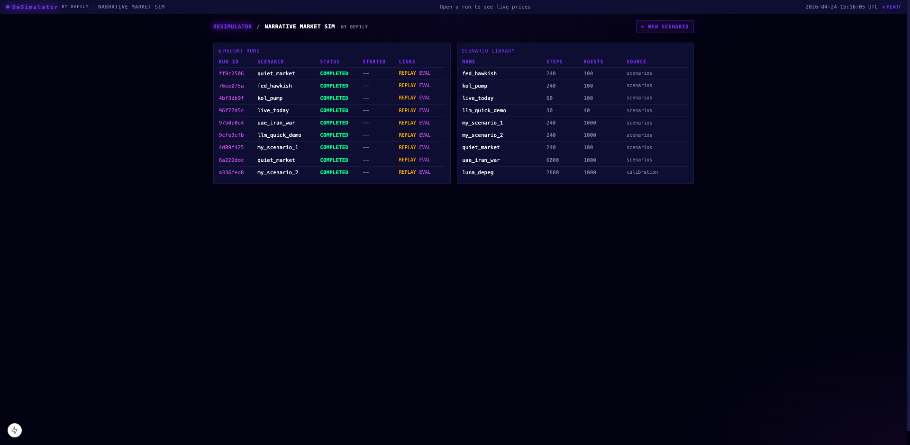
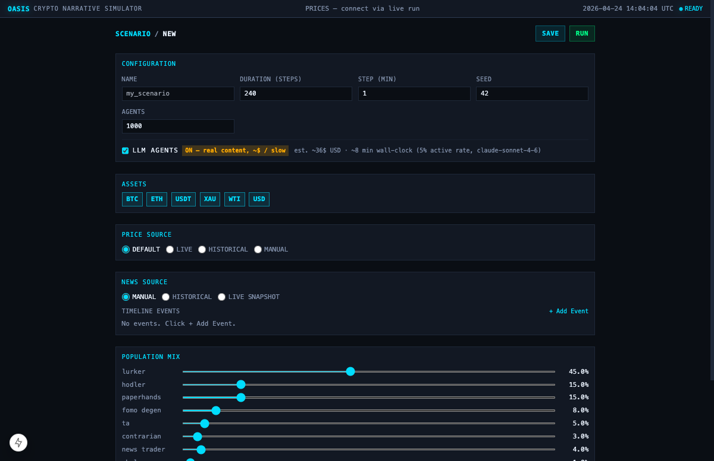
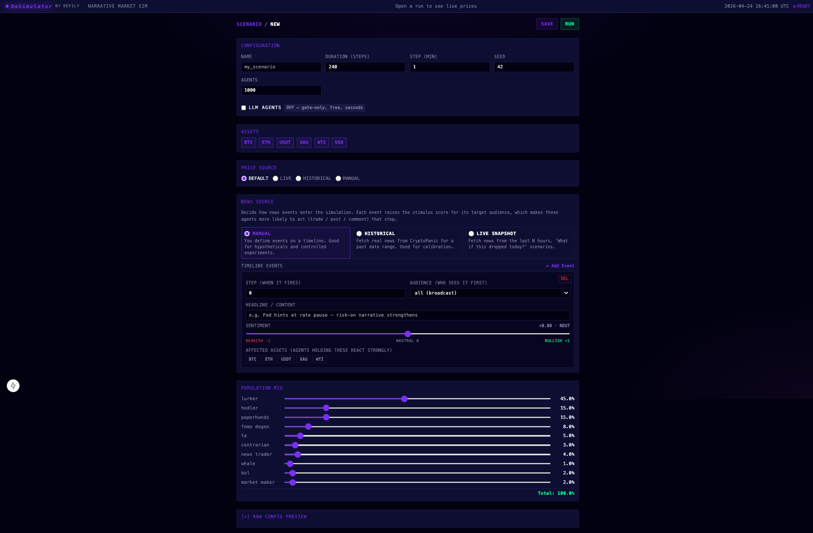
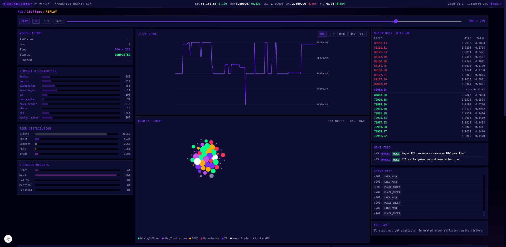

# DeSimulator — Crypto Narrative Market Sim

A narrative-driven cross-asset market simulator. Launch thousands of LLM (or
heuristic) agents across a 6-asset exchange, inject news events, and watch
prices, order books, and social feeds evolve.

Built by [Defily](https://www.defily.ai/) on top of
[CAMEL-AI/OASIS](https://github.com/camel-ai/oasis).

---

## What it simulates

- **6 assets**: BTC, ETH, USDT, XAU (gold), WTI (oil), USD
- **Up to 10,000 agents** with ten distinct personas (HODLer, FOMO Degen,
  Whale, KOL, Market Maker, Paperhands, Contrarian, News Trader, TA, Lurker)
- **Two decision modes**:
  - **Gate-only** (free, ~5 seconds) — agents act via heuristic rules
  - **LLM-backed** (Claude Sonnet, ~minutes, paid) — agents post and trade
    in their own voice
- **News injection**: hand-authored timeline, historical replay from
  CryptoPanic, or live-snapshot of today's news
- **End-to-end pipeline**: scenario YAML → matching engine → order book →
  trades → social posts → replay UI

---

## Quick start

### 1. Install

```bash
# Python backend deps (into your preferred venv — README assumes ~/venvs/aragen)
uv pip install --python ~/venvs/aragen/bin/python --quiet \
    pydantic pyyaml numpy pytest anthropic python-dotenv pyarrow \
    scipy pandas jinja2 plotly fastapi "uvicorn[standard]" \
    websockets httpx yfinance requests

# Frontend deps
cd ui/frontend && pnpm install && cd ../..
```

### 2. Set your API key (only needed for LLM-mode runs)

```bash
echo "ANTHROPIC_API_KEY=sk-ant-..." >> .env
```

`.env` is gitignored. The backend auto-loads it at startup.

### 3. Start the servers (two terminals)

```bash
# Terminal 1 — backend on :8000
~/venvs/aragen/bin/python -m uvicorn ui.backend.main:app --host 127.0.0.1 --port 8000

# Terminal 2 — frontend on :3000
cd ui/frontend && pnpm run dev
```

### 4. Open the UI

http://localhost:3000

---

## Features

### Home page



The landing page has two tables:

- **Recent Runs** — every completed/running simulation. Click REPLAY to open
  the analysis view, EVAL to open the score report.
- **Scenario Library** — YAML scenarios under `scenarios/` and
  `calibration/`. Click a name to edit; click `+ New Scenario` to create.

Five scenarios ship in the repo:

| Scenario | Purpose |
|---|---|
| `quiet_market` | No news, 240 steps — baseline behavior |
| `fed_hawkish` | Single bearish macro event at step 50 |
| `kol_pump` | KOL announces BTC buy → mainstream adoption story |
| `live_today` | Live prices + live news from CryptoPanic, 60 steps |
| `llm_quick_demo` | 30 steps × 40 agents, LLM-backed — fast narrative demo |
| `luna_depeg` (calibration) | 2022-05-07 historical replay of UST depeg |

### Scenario builder



The form covers everything needed to define a run:

- **Configuration**: name, duration in steps, step length in minutes, seed,
  agent count
- **LLM agents toggle**: OFF (free, heuristic) or ON (paid, real narrative
  content). When ON, a live cost + wall-time estimate appears:
  `~$36 USD · ~8 min (5% active rate, claude-sonnet-4-6)`
- **Assets**: toggle which of BTC/ETH/USDT/XAU/WTI/USD the sim trades
- **Price source**: default seeded prices, live Binance/yfinance snapshot,
  historical as-of-date, or fully manual override
- **News source**: see below
- **Population mix**: 10 archetype sliders that must sum to 100%

Two actions at the top right:

- **SAVE** writes the YAML to `scenarios/` (or updates the existing file
  in-place if editing)
- **RUN** saves and immediately launches a subprocess, navigating you to the
  live view

### News source editor



Three modes, each with a plain-language description card:

- **MANUAL** — you define every event yourself. Good for hypotheticals.
- **HISTORICAL** — fetches real news from CryptoPanic for a past date range.
  Used for calibration scenarios like `luna_depeg`.
- **LIVE SNAPSHOT** — fetches news from the last N hours. "What if this
  news dropped in the simulation today?"

Each timeline event is a labeled card with:

- **Step** — which simulation tick the event fires on (step 50 at 1min/step
  = 50 minutes into the sim)
- **Audience** — who sees the event first. Choices: `all` (broadcast),
  `news_traders`, `kols`, `crypto_natives`, `whales`. Events then propagate
  through the social graph based on audience → follower edges → reactions.
- **Headline / content** — text the agents see
- **Sentiment** — slider from −1 (very bearish) to +1 (very bullish). Drives
  the stimulus signal into the agent gate
- **Affected assets** — chip toggles for BTC / ETH / USDT / XAU / WTI.
  Agents holding these react more strongly.

In HISTORICAL and LIVE_SNAPSHOT modes, the timeline editor is still
available as a "Manual Overlay" so you can add hypothetical events on top
of real news.

### Run / Replay view



This is the hero view. The layout is a 4-column grid:

**Top bar**

- DeSimulator wordmark (links to Defily)
- Live ticker with % change per asset
- UTC clock

**Left rail**

- **Simulation** — scenario name, seed, step progress, status, elapsed time
- **Persona Distribution** — how many of each archetype were sampled for
  this run
- **Tier Distribution** — at the current step, what fraction of agents are
  Silent / React / Comment / Post / Trade. Silent dominates (~87%) in any
  realistic run — this matches social media's 1-9-90 rule.
- **Stimulus Weights** — the relative contribution of each stimulus source
  (price move, news events, follow-graph activity, mentions, personal
  replies) driving agent activity

**Center**

- **Price chart** — per-asset line. Tab between BTC / ETH / USDT / XAU /
  WTI. News events render as dotted vertical lines on the chart.
- **Social graph** — force-directed visualization of 100–10,000 agents
  colored by archetype. Nodes pulse when their agent posts; edges are
  follow relationships. Scroll to zoom, drag to pan.

**Right rail**

- **Order Book** — L2 depth for the selected pair, bids green, asks red
- **News Feed** — scenario-injected events with sentiment badges
- **Agent Feed** — streaming list of agent actions (buys, posts, likes)
- **Forecast** — ensemble outcome band across N seed runs (when eval runs
  are available)

**Bottom row**

- **PnL History** — aggregate wealth across all agents over time, priced at
  each step's last price
- **Recent Trades** — tape of filled trades with BUY/SELL chips colored by
  aggressor side
- **Eval Preview** — 3-tier score vector snapshot. Click "Open full eval"
  for the complete report.

**Social Feed** (full-width, bottom of page)

Every agent post with archetype-colored handle, post content, nested
comments (up to 5 per post), like/dislike tallies. In LLM mode this is
where the sim's narrative shines — real in-voice posts from FOMO degens,
KOLs writing threads, whales dropping one-liners.

**Scrubber controls** (top of replay)

- PLAY / PAUSE button
- Speed: 1x / 10x / 100x
- Step slider — click or drag to any point in the run. All panels sync to
  the selected step.

### God-mode news injection (live runs)

While a simulation is running, you can inject a news event via the API:

```bash
curl -X POST http://localhost:8000/api/runs/{run_id}/inject-news \
  -H "Content-Type: application/json" \
  -d '{
    "title": "SEC approves spot ETF",
    "content": "Major regulatory milestone for crypto markets.",
    "sentiment_valence": 0.9,
    "affected_assets": ["BTC", "ETH"],
    "audience": "all",
    "magnitude": "critical",
    "credibility": "confirmed"
  }'
```

The event fires at the next simulation step. Agents react within a few
steps; the social feed reflects propagation in real time.

### Eval mode

For any completed run:

```bash
~/venvs/aragen/bin/python scripts/evaluate.py \
    results/run_<id>/ \
    --mode historical
```

Produces `eval_report.html` + `eval_report.md` + `eval_report.json` in the
run directory. Three modes:

- **historical** — compares sim to real prices + real news (via Binance,
  yfinance, Fear & Greed Index, CryptoPanic)
- **sanity** — no ground truth available; scores against baselines
  (random_walk, constant, replay, no_news, shuffled_news, …)
- **stress** — stress tests per archetype

The report covers six metric tiers: price path, style facts (kurtosis, vol
clustering), microstructure, cross-asset correlations, social volume,
agent-level P&L.

---

## Cost and performance

At the default **240 steps × 1000 agents**:

| Mode | Wall clock | API cost |
|---|---|---|
| Gate-only | ~30 seconds | $0 |
| LLM (gpt-4o-mini) | ~8 minutes | ~$1–5 |
| LLM (claude-sonnet-4-6) | ~15 minutes | ~$30–50 |

The scenario builder shows a live cost + time estimate as you change
duration and agent count.

For quick iteration use `scenarios/llm_quick_demo.yaml` (30 steps × 40
agents, ~2 min, ~$0.50).

---

## Where things live

```
oasis/crypto/           — simulation engine (matching, personas, gate, harness)
oasis/crypto/eval/      — metrics, baselines, ground truth
scenarios/              — YAML scenarios
calibration/            — historical replay scenarios
scripts/                — run_scenario.py, evaluate.py, generate_personas.py
ui/backend/             — FastAPI server
ui/frontend/            — Next.js terminal UI
data/personas/          — archetype templates + generated library
results/                — every run's parquet outputs + simulation.db
```

Run telemetry lands in `results/run_<id>/` as:

- `actions.parquet` — every agent action per step
- `trades.parquet` — every filled trade
- `prices.parquet` — per-step OHLC + volume per pair
- `tiers.parquet` — tier distribution per step
- `stimuli.parquet` — per-agent stimulus components per step
- `conservation.parquet` — aggregate balance checks per step
- `news.parquet` — injected news events (only when scenario has any)
- `simulation.db` — SQLite mirror of everything above, plus social graph,
  posts, comments

---

## Common tasks

### Run a gate-only scenario from the CLI

```bash
~/venvs/aragen/bin/python scripts/run_scenario.py \
    scenarios/kol_pump.yaml --no-llm --seed 42
```

### Run an LLM-backed scenario via the UI

1. Home → `+ New Scenario`
2. Configure, **check LLM agents toggle**
3. Click RUN
4. You're redirected to the live view, which streams step-by-step
   telemetry until the run completes, then auto-switches to replay

### Generate a fresh 10k persona library (one-time, ~$30)

```bash
~/venvs/aragen/bin/python scripts/generate_personas.py \
    --count 10000 \
    --output data/personas/library.jsonl \
    --seed 42
```

Scenarios automatically fall back to `library_smoke_100.jsonl` (100
persona smoke library, already committed) when the full library isn't
present, so this is optional.

---

## Troubleshooting

- **"WebSocket closed before connecting"** — you're on `/run/{id}`
  (live view) for a completed run. Navigate to `/run/{id}/replay` instead;
  the UI will auto-redirect for you on fresh clicks.
- **"Cannot find module './687.js'"** — Next.js dev cache corruption
  after mixing `pnpm build` and `pnpm dev`. Fix:
  `rm -rf ui/frontend/.next && pnpm run dev`
- **API key error in subprocess** — ensure `.env` exists at repo root
  and contains `ANTHROPIC_API_KEY=...`. Both the backend and
  `scripts/run_scenario.py` load `.env` at startup.
- **No trades / no stimulus / empty panels** — try a fresh run. Older runs
  (before recent telemetry fixes) may have empty `stimuli.parquet` or
  `tiers.parquet`.

---

## License

Apache 2.0 (inherits from CAMEL-AI/OASIS).
